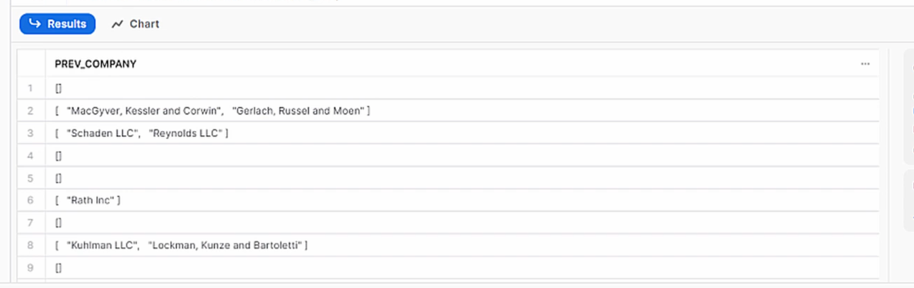

# datos-no-estructurados
1. [Creación del stage y el fichero bruto con datos no estructurados (JSON)](#schema1)
2. [Parseo y análisis del fichero no estructurado JSON](#schema2)
3. [Manejo de datos nested y arrays](#schema3)


<hr>

<a name="schema1"></a>

## 1. Creación del stage y el fichero bruto con datos no estructurados (JSON)


- Creación de esquema y internal_stage
```SQL
CREATE OR REPLACE SCHEMA MANAGE_DB.INTERNAL_STAGES
CREATE OR REPLACE stage MANAGE_DB.INTERNAL_STAGES.JSONSTAGE
```
- Podemos realizar carga desde un fichero local al internal stage creado o bien crear un external stage a la URL del fichero JSON
```SQL
CREATE OR REPLACE stage MANAGE_DB.EXTERNAL_STAGES.JSONSTAGE
     url='s3://bucketsnowflake-jsondemo';

// Definimos el formato tipo JSON
CREATE OR REPLACE file format MANAGE_DB.FILE_FORMATS.JSONFORMAT
    TYPE = JSON;
```
- Creamos la fila con el JSON

```SQL
CREATE OR REPLACE table PRIMERABBDD.PRIMERESQUEMA.JSON_RAW (
    raw_file variant);
    
COPY INTO PRIMERABBDD.PRIMERESQUEMA.JSON_RAW
    FROM @MANAGE_DB.INTERNAL_STAGES.JSONSTAGE
    file_format= MANAGE_DB.FILE_FORMATS.JSONFORMAT
    files = ('HR_data.json');
    
   
SELECT * FROM PRIMERABBDD.PRIMERESQUEMA.JSON_RAW;
```


<hr>

<a name="schema2"></a>

## 2. Parseo y análisis del fichero no estructurado JSON

- Seleccionar atributo/columna

```SQL
SELECT RAW_FILE:city FROM PRIMERABBDD.PRIMERESQUEMA.JSON_RAW
```


```sql
SELECT $1:first_name FROM PRIMERABBDD.PRIMERESQUEMA.JSON_RAW
```


- Seleccionar atributo/columna - formateo y conversión
```sql
SELECT RAW_FILE:first_name::string as first_name  FROM PRIMERABBDD.PRIMERESQUEMA.JSON_RAW;
```


```sql
SELECT RAW_FILE:id::int as id  FROM PRIMERABBDD.PRIMERESQUEMA.JSON_RAW;
```


```sql
SELECT 
    RAW_FILE:id::int as id,  
    RAW_FILE:first_name::STRING as first_name,
    RAW_FILE:last_name::STRING as last_name,
    RAW_FILE:gender::STRING as gender

FROM PRIMERABBDD.PRIMERESQUEMA.JSON_RAW;
```


<hr>

<a name="schema1"></a>

## 3. Manejo de datos nested y arrays

- Manejo de datos nested
```sql   
SELECT RAW_FILE:job as job  FROM PRIMERABBDD.PRIMERESQUEMA.JSON_RAW;
```


- Usando el `.` accedemos al nivel que queremos

```sql
SELECT 
      RAW_FILE:job.salary::INT as salary
FROM PRIMERABBDD.PRIMERESQUEMA.JSON_RAW;

```


```sql
SELECT 
    RAW_FILE:first_name::STRING as first_name,
    RAW_FILE:job.salary::INT as salary,
    RAW_FILE:job.title::STRING as title
FROM PRIMERABBDD.PRIMERESQUEMA.JSON_RAW;
```


- Manejo de arrays
```sql
SELECT
    RAW_FILE:prev_company as prev_company
FROM PRIMERABBDD.PRIMERESQUEMA.JSON_RAW;
```

- Acceder al elemento del array con `[posición]`
```sql
SELECT
    RAW_FILE:prev_company[1]::STRING as prev_company
FROM PRIMERABBDD.PRIMERESQUEMA.JSON_RAW;
```


- contar el total de elemento que hay en ese array
```sql
SELECT
    ARRAY_SIZE(RAW_FILE:prev_company) as prev_company
FROM PRIMERABBDD.PRIMERESQUEMA.JSON_RAW;
```

